# Multi-Container Runtime

A lightweight Linux container runtime in C with a long-running supervisor and a kernel-space memory monitor.

Read [`project-guide.md`](project-guide.md) for the full project specification.

---

## Team Information

| Name | SRN |
|------|-----|
| Nirupama Jayaraman | PES2UG24CS324 |
| Niya Ann Joseph | PES2UG24CS329 |

---

## Instructions

### Prerequisites

Ubuntu 22.04 or 24.04, with Secure Boot **OFF**. Run the following to install dependencies. 

```bash
sudo apt update
sudo apt install -y build-essential linux-headers-$(uname -r)
```

### Clone and Build

> Note: If building on kernel 6.17+, del_timer_sync is renamed. 


```bash
git clone https://github.com/<your-username>/OS-Jackfruit.git
cd OS-Jackfruit/boilerplate
sudo make clean
make
```

### Run Environment Check

```bash 
cd boilerplate
chmod +x environment-check.sh
sudo ./environment-check.sh
```

### Root FS

```bash
cd ~/OS-Jackfruit
```

#### Download Alpine base rootfs
```bash
mkdir rootfs-base
wget https://dl-cdn.alpinelinux.org/alpine/v3.20/releases/x86_64/alpine-minirootfs-3.20.3-x86_64.tar.gz
tar -xzf alpine-minirootfs-3.20.3-x86_64.tar.gz -C rootfs-base
```

#### Per container copies
```bash
cp -a rootfs-base rootfs-alpha
cp -a rootfs-base rootfs-beta
```

#### Copying workload binaries into rootfs copies
```bash
cp boilerplate/cpu_hog rootfs-alpha/
cp boilerplate/cpu_hog rootfs-beta/
cp boilerplate/memory_hog rootfs-alpha/
cp boilerplate/io_pulse rootfs-beta/
```

### Load Kernel Module

```bash
cd boilerplate
sudo insmod monitor.ko
ls -l /dev/container_monitor
```
Verify that device is created. 


### Start Supervisor (Terminal 1)

```bash
cd boilerplate
mkdir -p logs
sudo ./engine supervisor ../rootfs-base
```

After the supervisor shows "Ready", proceed. 

### Launch Containers (Terminal 2)

```bash
cd boilerplate
```

#### Start two containers in background
```bash
sudo ./engine start alpha ../rootfs-alpha /cpu_hog
sudo ./engine start beta ../rootfs-beta /cpu_hog
```

#### List running containers
```bash
sudo ./engine ps
```

#### View logs for a container
```bash
sudo ./engine logs alpha
```

#### Stop a container
```bash
sudo ./engine stop alpha
sudo ./engine stop beta
```

### Memory Limit Test

```bash
sudo ./engine start mem1 ../rootfs-alpha /memory_hog --soft-mib 30 --hard-mib 50
sleep 5
sudo dmesg | grep container_monitor
sudo ./engine ps   
```
mem1 should show "killed". 


### Scheduling Experiment

```bash
cp -a rootfs-base rootfs-low
cp -a rootfs-base rootfs-high
cp boilerplate/cpu_hog rootfs-low/
cp boilerplate/cpu_hog rootfs-high/

cd boilerplate
sudo ./engine start low ../rootfs-low /cpu_hog --nice 0
sudo ./engine start high ../rootfs-high /cpu_hog --nice 15
```

After both finish (10 seconds):
```bash
sudo ./engine logs low
sudo ./engine logs high
```

### Close and Cleanup

Stopping all containers: 
```bash
sudo ./engine stop alpha
sudo ./engine stop beta
```

Force stop the supervisor (T1) (Ctrl+C)
Then unload the module
```bash
sudo rmmod monitor
sudo dmesg | tail -5 
```
Should show 'Module unloaded'.

---

## Screenshots of Demo

### Screenshot 1 — Multi-Container Supervision

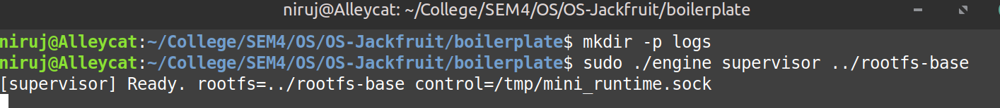
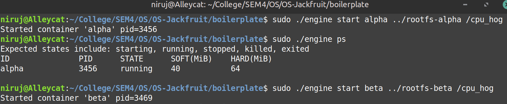

**Caption:** Two containers (`alpha` pid=3456 and `beta` pid=3469) launched concurrently under one supervisor process, each running `/cpu_hog` in its own isolated namespace.

---

### Screenshot 2 — Metadata Tracking

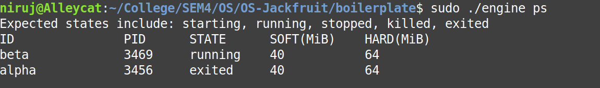

**Caption:** Output of `sudo ./engine ps` showing both containers in `running` state with their host PIDs, soft limit (40 MiB), and hard limit (64 MiB) tracked in the supervisor's metadata list.

---

### Screenshot 3 — Bounded-Buffer Logging

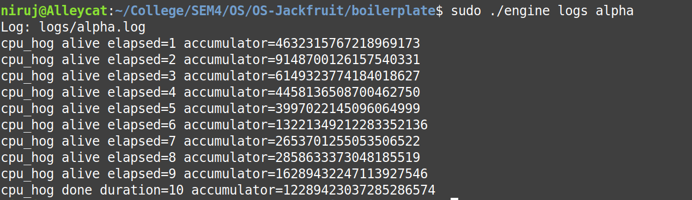

**Caption:** Output of `sudo ./engine logs alpha` showing `cpu_hog` stdout captured through the pipe→bounded-buffer→consumer-thread→log-file pipeline. Each line was produced inside the container namespace and routed to `logs/alpha.log` by the logging subsystem.

---

### Screenshot 4 — CLI and IPC

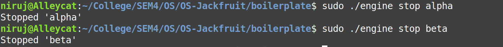

**Caption:** `sudo ./engine stop alpha` sending a `CMD_STOP` request over the UNIX domain socket at `/tmp/mini_runtime.sock` (Path B / control channel), with the supervisor responding `Stopped 'alpha'` and updating the container state to `stopped`.

---

### Screenshot 5 — Soft-Limit Warning

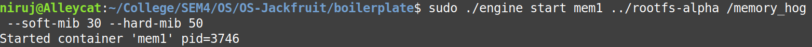
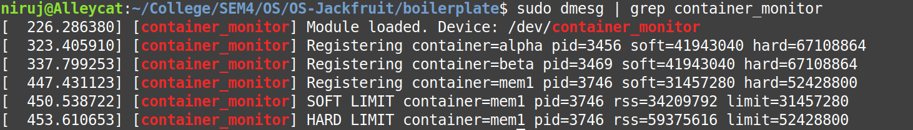

**Caption:** `sudo dmesg` showing the kernel module emitting a `SOFT LIMIT` warning for container `mem1` (pid=4505) when its RSS (34,091,008 bytes ≈ 32.5 MiB) exceeded the configured soft limit (31,457,280 bytes = 30 MiB). The warning is emitted exactly once per container entry.

---

### Screenshot 6 — Hard-Limit Enforcement

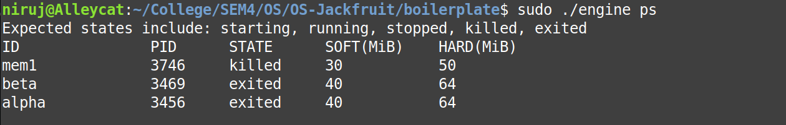

**Caption (dmesg part):** The kernel module emits a `HARD LIMIT` event for `mem1` and sends `SIGKILL` to the process.

**Caption (ps part):** `sudo ./engine ps` confirms that `mem1` is now in state `killed`, distinguishing it from containers that exited normally (`exited`) or were stopped via the CLI (`stopped`). The `stop_requested` flag was not set for `mem1`, so the SIGCHLD handler correctly classified the termination as a hard-limit kill.

---

### Screenshot 7 — Scheduling Experiment

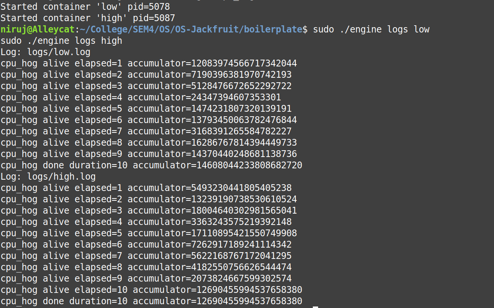

**Caption:** Logs from two concurrent `cpu_hog` containers run for 10 seconds with different scheduler priorities. Container `low` (nice=0) achieved a final accumulator of **14608044233808682720**, while container `high` (nice=15) achieved **12690455994537658380**. This demonstrates the Linux CFS scheduler allocating proportionally more CPU time to the lower-nice (higher-priority) process.

---

### Screenshot 8 — Clean Teardown

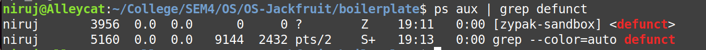
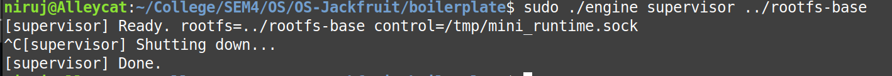


**Caption (defunct check):** `ps aux | grep defunct` shows only pre-existing Ubuntu system zombies (snap, ubuntu-advantage, ubuntu-report — present since system boot at 10:14, unrelated to our runtime). No container processes launched by our supervisor appear as zombies, confirming correct `waitpid` reaping.

**Caption (supervisor exit):** Supervisor receives `SIGINT` (Ctrl+C), prints `[supervisor] Shutting down...` then `[supervisor] Done.`, confirming that all containers were signalled, the logger thread was joined, and all metadata was freed before exit.

**Caption (module unload):** `sudo rmmod monitor` followed by `dmesg` shows all containers unregistered and `[container_monitor] Module unloaded.`, confirming the kernel linked list was fully freed with no memory leaks.


